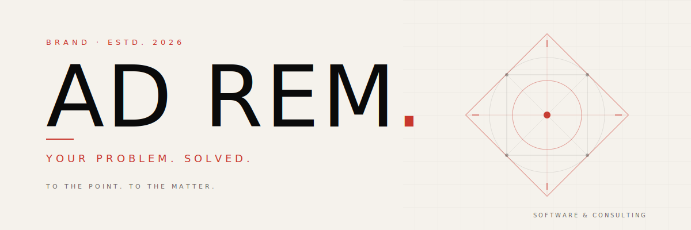

<picture>
  <source media="(prefers-color-scheme: dark)" srcset="assets/hero-dark.svg">
  
</picture>

---

## To the matter.

**You bring the problem. We build what solves it.**

Custom-fit to your business and sized to your ask, no matter how big or small. One-off scripts to full systems, weekend fixes to multi-month builds: the work is shaped around what *you* actually need. No complexity theater. No bloat. Made for you.

---

### What we build

**Custom Applications.** Web apps, internal tools, client portals, automations. Whatever your business actually does, we build the software that fits *that*. No bending your workflow around off-the-shelf tools that almost work.

**Solo Operators & Small Teams.** Freelancers, creators, individual professionals. Your project gets the same depth of thinking as any enterprise engagement. The size of the ask doesn't change the quality of the answer.

**Advisory & Planning.** Before you build anything, figure out what to build. We help you scope the right thing, pick the right stack, and avoid spending months on the wrong project. Pay for clarity, not just code.

---

### What to expect

**Clear scope, clear price.** Before any code is written, you'll know what's being built, what it costs, and when it ships. No surprise invoices, no scope drift.

**Real recommendations.** Need a decision? You'll get one. Honest, specific, with reasoning you can push back on.

**Available after launch.** Bugs, tweaks, what-if questions. We stay in the conversation when the project goes live, not just until it ships.

---

### Tell us what's broken.

We'll tell you what to build.

**Web** · [adrem.services](https://adrem.services)
**Schedule a call** · [cal.com/ad-rem](https://cal.com/ad-rem)

---

AD REM, LLC · Software &amp; Consulting · <a href="https://adrem.services">adrem.services</a>
